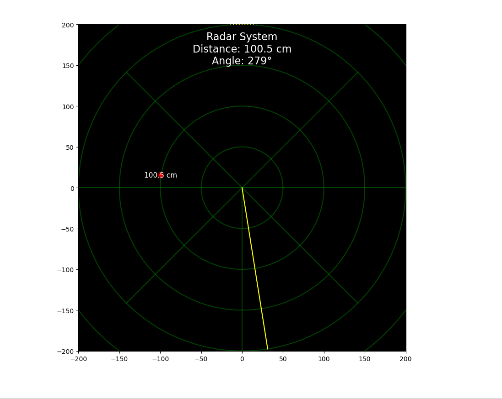
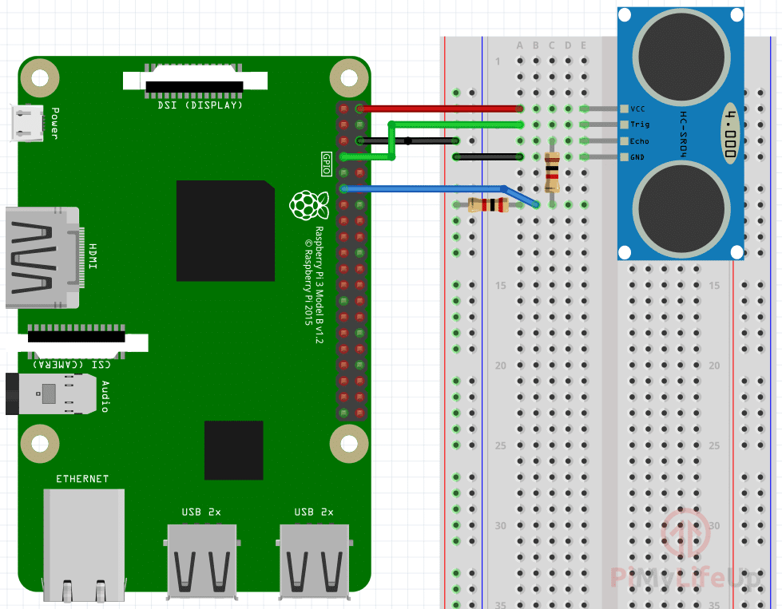

# GPIO Ultrasonic Radar System Monitoring



## Deskripsi
Proyek ini adalah simulasi sederhana dari sistem monitoring radar menggunakan Raspberry Pi, GPIO, dan sensor ultrasonic. Proyek ini menggunakan teknologi Python dan matplotlib untuk visualisasi data radar.

## Komponen yang Diperlukan
- Raspberry Pi
- Sensor Ultrasonic HC-SR04
- Resistor 330 ohm
- Resistor 470 ohm
- Kabel Jumper 

  ## Diagram
  

## Instalasi

1. Pastikan Anda memiliki Python terinstal di komputer Anda. Anda dapat mengunduhnya dari [Python.org](https://www.python.org/downloads/).
2. Pasang package matplotlib menggunakan pip:
    ```bash
    pip install matplotlib
    ```
3. Pastikan Anda telah menghubungkan Raspberry Pi dengan sensor ultrasonik dan mengonfigurasinya sesuai dengan skema koneksi yang diberikan.

## Penggunaan

1. Pastikan semua koneksi sudah terpasang dengan benar.
2. Jalankan skrip `radar.py` di Raspberry Pi dengan perintah:
    ```bash
    python radar.py
    ```
3. Amati tampilan radar yang ditampilkan dan perhatikan objek yang terdeteksi serta informasi jarak dan kecepatannya.

## Kontribusi

Jika Anda ingin berkontribusi pada proyek ini, silakan buka pull request dan deskripsikan perubahan yang ingin Anda ajukan. Kami sangat terbuka terhadap saran dan kontribusi dari berbagai pihak.

## Lisensi

Proyek ini dilisensikan di bawah Lisensi MIT - lihat file [LICENSE](LICENSE) untuk detail lebih lanjut.
